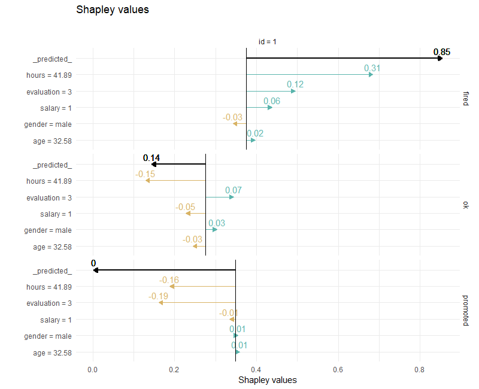
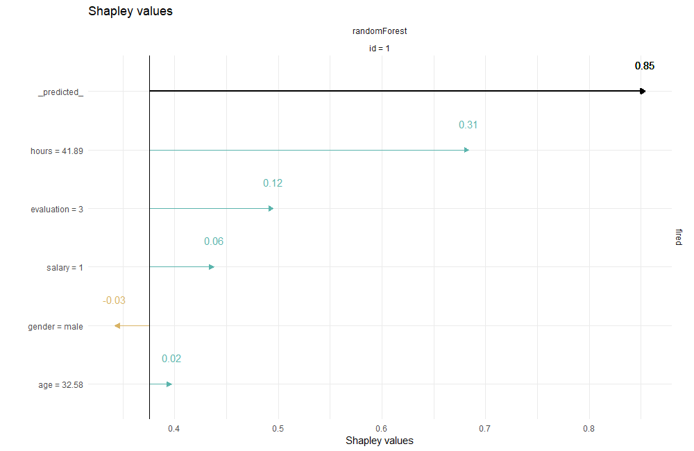
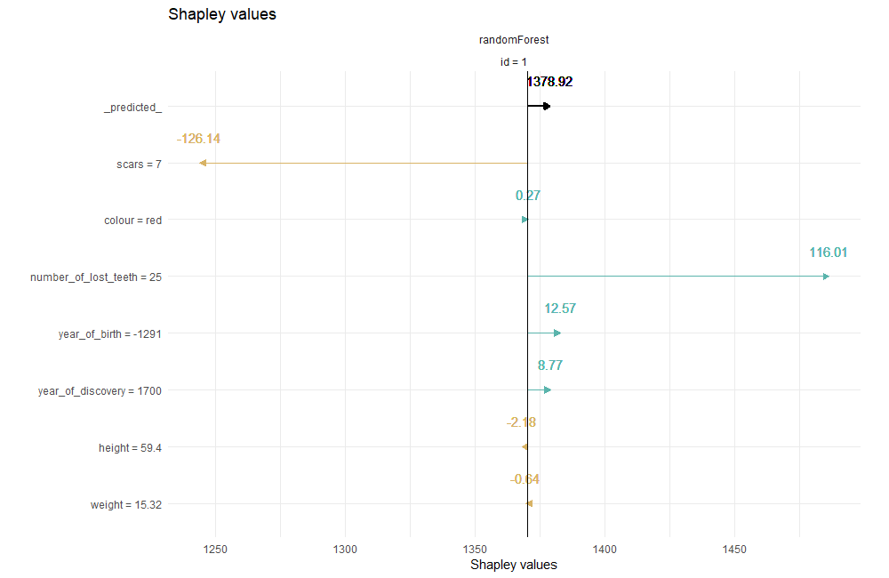

# shapper

[](https://CRAN.R-project.org/package=shapper)
[](https://travis-ci.org/ModelOriented/shapper)
[](https://codecov.io/github/ModelOriented/shapper?branch=master)
[](https://mybinder.org/v2/gh/ModelOriented/shapper/master?filepath=binder%2Fshapper.ipynb)

An R wrapper of SHAP python library

[Pkgdown Website]( https://modeloriented.github.io/shapper/)

## Instalation

```
devtools::install_github("ModelOriented/shapper")
```
You can install shap Python library via

```
shapper::install_shap()
```

## Classification Example

```
# instal shapper
# devtools::install_github("ModelOriented/shapper")

# install shap python library
# shapper::install_shap()

# load datasets
# devtools::install_github("ModelOriented/DALEX2")
library("DALEX2")
Y_train <- HR$status
x_train <- HR[ , -6]

# Let's build models
library("randomForest")
set.seed(123)
model_rf <- randomForest(x = x_train, y = Y_train)

# here DALEX2 starts
rf_explainer <- explain(model_rf, data = x_train)

# here shapper starts
# load shapper
library(shapper)
ive_rf <- individual_variable_effect(rf_explainer,
                                     new_observation = x_train[1:2,], nsamples =50)

# plot
plot(ive_rf)
```

 


```
# filtered
ive_rf_filtered <- dplyr::filter(ive_rf, `_ylevel_` =="fired")
class(ive_rf_filtered) <- c("individual_variable_effect", "data.frame")
plot(ive_rf_filtered)
```

 


# Regression example

```
library(shapper)

library("DALEX2")
library("randomForest")

Y_train <- dragons$life_length
x_train <- dragons[ , -8]

set.seed(123)
model_rf <- randomForest(x = x_train, y = Y_train)

ive_rf <- individual_variable_effect(model_rf, data = x_train,
                                     new_observation = x_train[1,])

plot(ive_rf)
```

 
